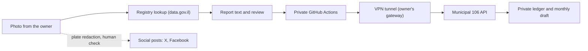

# Parking Report Helper

[](https://github.com/reihlinstinct/parking-report-helper/actions/workflows/tests.yml)
[](https://github.com/reihlinstinct/parking-report-helper/commits/main)
[](https://github.com/reihlinstinct/parking-report-helper/issues)
[](https://github.com/reihlinstinct/parking-report-helper/pulls?q=is%3Apr+is%3Aclosed)
[](pyproject.toml)
[](Dockerfile)
[](LICENSE)
[](docs/API106.md)

A Python engine that turns citizen photo evidence of street hazards in Jerusalem
(mainly cars parked on sidewalks) into ready-to-file municipal reports. It prepares
Hebrew report text, checks vehicles against the government registry, files cases
through the municipality's 106 API and keeps duplicate and audit state. Report
text is Hebrew; code and documentation are English.

This repository is the **engine**. It holds code, a captured municipal subject
catalog and synthetic tests only. Real photos, plates, reporter identity,
registry snapshots and credentials live in a separate private repository,
`parking-reports`, which runs reviewed versions of this code. Nothing private
belongs here.

## How the system works



1. **Intake.** Each report is a private folder with the original photo and a
   `report.json` (time, street and house number, event category, plate for
   vehicles). Missing or ambiguous evidence stops for review; nothing is guessed.
2. **Per-report category.** Every report picks its own municipal subject from the
   captured catalog (86 entries, 72 distinct codes); there is no global switch.
   The default is sidewalk parking. Other events, such as graffiti, need no plate.
   Crosswalk and ramp subjects are not yet verified against the live service. See
   [docs/SUBJECTS.md](docs/SUBJECTS.md).
3. **Registry lookup.** For vehicle reports the engine queries the Ministry of
   Transport datasets on data.gov.il, one exact plate per request, and keeps make,
   model, colour, year, last test date, licence expiry and disability-tag result.
   No owner identity or chassis data is requested. A missing match means unknown,
   never "no valid licence". See [docs/REGISTRY.md](docs/REGISTRY.md).
4. **Where registry data goes.** The municipal text states make, model, colour,
   licence validity, last test date and disability-tag status, and never
   coordinates; the owner reviews the exact text before filing. Public posts carry
   only the tag status, plus licence or test status when it is missing or expired.
   Raw registry snapshots are never published.
5. **Filing through the 106 API.** The private repository runs this code in GitHub
   Actions: login, contact registration, case creation, photo upload. GitHub-hosted
   runners are blocked by the municipal login (HTTP 403), so the job first opens an
   L2TP/IPsec tunnel through the owner's own gateway. Only tunnel bring-up is
   retried (after 1 minute, then 5 minutes). **No municipal request is ever
   retried**, so a timeout cannot create a duplicate case. Each live attempt is
   approved per report: the exact text, photo, address and subject are reviewed,
   bound to a digest and consumed once. See [docs/API106.md](docs/API106.md).
6. **Duplicate protection.** A private durable ledger records stable report IDs and
   original-photo SHA-256 hashes, with a checkpoint before every side effect. A
   repeated photo or changed inputs for a reserved ID stop for review, and one run
   at a time is enforced.
7. **Ledger and monthly draft.** Each filed report is a row in a private CSV with
   the municipal reference. Mappings are marked `verified_receipt`,
   `owner_stated_order` or `unverified_fifo`, and only exact receipts count as
   verified. A report counter badge publishes the number of referenced rows only.
   An offline module prints a Hebrew monthly summary (counts by street and event
   type) for the owner to review. It sends nothing. See [docs/MONTHLY.md](docs/MONTHLY.md).
8. **Social posts and plate redaction.** Posts are separate from municipal cases.
   A private pipeline detects plates and faces locally (EgoBlur), draws opaque
   rectangles, strips EXIF/GPS metadata and writes a review bundle. The pipeline
   fails closed: missing models, wrong hashes or a changed image or caption stop it,
   and a person must inspect the whole final image before anything is published.
   Detection is experimental and can miss small background plates, so the human
   check is required. X posts are made by the Instinct assistant. Facebook
   publishing is disabled until a Page access token is set up.

For the full diagram and responsibilities of both repositories, see
`docs/ARCHITECTURE.md` in the private `parking-reports` repository (collaborators
only).

## Safety rules

- Never auto-submits, never touches a CAPTCHA, never retries a municipal write.
- No real plates, names, ID numbers, locations, photos or keys in this repository,
  its Actions logs or its artifacts. Tests use synthetic data.
- Private Actions pin this code at a reviewed full commit SHA, so a change here
  does not reach filing until the pin is updated in a reviewed change.
- A flag in a record is an audit trail, not consent.

## Repository security

- `main` is protected by an active ruleset: changes need a pull request and all
  required checks green (tests plus security scans).
- CodeQL, dependency review, Dependabot and an OpenSSF Scorecard workflow run in
  CI; workflow Actions are pinned to commit SHAs.
- The private `parking-reports` repository is limited by its GitHub plan: some
  protections there (for example CodeQL and dependency review on a private
  repository) may need a paid plan. Their status is tracked in that repository's
  issues, so it is not restated here. Code scanning runs on this public repository.
- Report vulnerabilities privately; see [SECURITY.md](SECURITY.md).

## Requirements

Python 3.10 or later, or Docker. The core CLI has no third-party dependencies; the
API runner uses the `api` extra.

## Install and run

```sh
pip install .
parking-report sample.json
parking-report sample.json --city "Example City" --name "Example Reporter"
parking-report sample.json --no-photo
```

`python -m parking_report sample.json` works too. Supply city and reporter values in
Hebrew when preparing a Hebrew report.

## Docker

The image is based on `python:3.13-slim`, runs as a non-root user, and uses
`parking-report` as its entrypoint. The working directory is `/data`:

```sh
docker build -t parking-report-helper .
docker run --rm -v "$PWD:/data:ro" parking-report-helper sample.json
```

Run the test suite inside Docker with `docker build --target test .`.

## Offline preview and the API runner

```sh
pip install ".[api]"
parking-report-106 /private/reports/REPORT_FOLDER --addresses /private/addresses.json
```

Preview validates one ready record, builds the Hebrew text, resolves the municipal
street code, converts coordinates and prepares a resized JPEG without EXIF. It makes
no network calls. Live submission is a separate, explicitly approved step that
runs in the private repository; see [docs/API106.md](docs/API106.md) and
[docs/INTAKE.md](docs/INTAKE.md).

## Municipality reports (Jerusalem)

`--municipality jerusalem` prints copy-paste values for the fields of the Jerusalem
Municipality 106 web form (https://www.jerusalem.muni.il/he/contactus/106/): first
and last name, ID type and number, phones, email, city, street, house number and the
report text. This command only formats text and field values for manual use. Automated filing
uses the API through `parking-report-106`; no browser automation remains. For manual
use, paste the values and attach up to 3 photos (png, jpg, pdf, tif, gif or doc,
5 MB each) yourself.

```sh
parking-report sample.json --municipality jerusalem --reporter ~/reporter.json
parking-report sample.json --municipality jerusalem --reporter ~/reporter.json --json
```

The reporter file holds your own details and must stay outside this repository:

```json
{"first_name": "...", "last_name": "...", "id_type": "תעודת זהות",
 "id_number": "...", "phone": "...", "phone2": "", "email": "..."}
```

Required values that are not supplied print as `<חסר>`.

### Adding another municipality

Each municipality is one JSON file in `src/parking_report/configs/` with the channel
details (URL, hotline, whether submission is manual), attachment limits and an ordered
`fields` list. A field has a `key`, the form `label`, `required`, and a `source`:
`reporter` (from the reporter file), `config` (a fixed value such as `city`) or
`car`/`report` (derived from the input). Use a file outside the package with
`--municipality path/to/city.json`.

## Code layout

```
src/parking_report/report.py        Car dataclass and report formatting (no I/O)
src/parking_report/municipality.py  config loading, form field values
src/parking_report/cli.py           argparse CLI, installed as `parking-report`
src/parking_report/api106.py        optional direct API transport and state guards
src/parking_report/api_cli.py       106 runner (offline preview by default)
src/parking_report/ledger.py        durable duplicate and state ledger
src/parking_report/monthly.py       offline Hebrew monthly draft
src/parking_report/subjects.py      per-report municipal subject catalog
src/parking_report/registry.py      government registry lookup and Hebrew description
src/parking_report/configs/         per-municipality JSON configs
tests/                              unit, CLI and functional tests
docs/                               DESIGN, API106, REGISTRY, SUBJECTS, MONTHLY, INTAKE
```

See [docs/DESIGN.md](docs/DESIGN.md) for the layering rules and the safety invariants.

## Input format

The input must be a JSON array of objects. Required fields are nonempty strings:

| Field | Description |
| --- | --- |
| `plate` | Vehicle plate number |
| `street` | Street and building number |
| `datetime` | Date and time in `YYYY-MM-DD HH:MM` or `YYYY-MM-DDTHH:MM` format |

Optional fields are `car_type` and `notes`. The Hebrew examples in `sample.json`
use synthetic plate numbers and an example address. Do not commit real plates,
names, locations, photos, or credentials to this public repository.

## Output and errors

Reports are written to stdout, separated by a blank line. An empty input array
produces no reports. Input errors exit with status 1 and a short error on stderr,
without a traceback or partial reports. Invalid records identify their position
in the array.

## Tests

```sh
pip install .
python -m unittest discover -s tests -v
```

Unit tests cover formatting, intake, config validation, API duplicate/uncertain-result
guards and private registry lookups. Functional tests run the real CLI with
synthetic data and generated photos. No test contacts the municipality. Browser
fill tests, mock-form fixtures, Playwright/stealth dependencies and the read-only
website-probe workflow are removed because 106 reporting now uses the API.

Registry enrichment runs in the private caller repository only. See
[docs/REGISTRY.md](docs/REGISTRY.md) for fields and unknown-result handling.
Reporter fields and API credentials stay in private secrets/env, never public code.
Live submission runs only in the private repository, per approved report.

## Continuous integration

GitHub Actions runs the suite on Python 3.10 to 3.13 for every push and pull request.
A separate job builds the Docker image, runs the tests inside it, and smoke-tests the
container. Nothing is published. Workflows use read-only repository permissions and
need no secrets.

## Render HTTP connectivity check (diagnostic)

`Dockerfile.render` builds a small authenticated Login-check service that was used
to test hosting options. It is not the filing route: production filing goes through
GitHub Actions and the VPN tunnel described above. See
[docs/HTTP106.md](docs/HTTP106.md).

## Other municipal issues and per-report category selection

The API runner accepts `municipal_subject` on each private `report.json`.
Select any subject code from the captured catalog, including broken signs and
graffiti. Non-parking drafts do not require a vehicle plate or request a parking
inspector. Default sidewalk code 1145 stays unchanged. Exact owner review is
still required before filing. See [SUBJECTS.md](docs/SUBJECTS.md) for the record
fields, examples, snapshot limits and approval rules.

## Monthly municipal draft (offline only)

`python -m parking_report.monthly /private/ledger/reports.csv --month 2026-10`
prepares a Hebrew monthly draft with counts by street/type and the complete
municipal references. Unverified associations stay visibly unverified; duplicate
IDs/references or invalid dates stop the draft. Plates and registry details are
omitted. Use a private destination, never public logs/artifacts. No email,
schedule, case verification or filing is performed. See [MONTHLY.md](docs/MONTHLY.md)
for the CSV schema, counting limits and review requirement.
